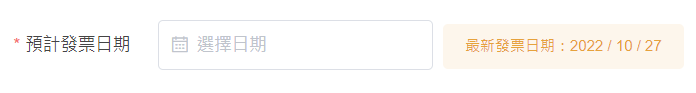
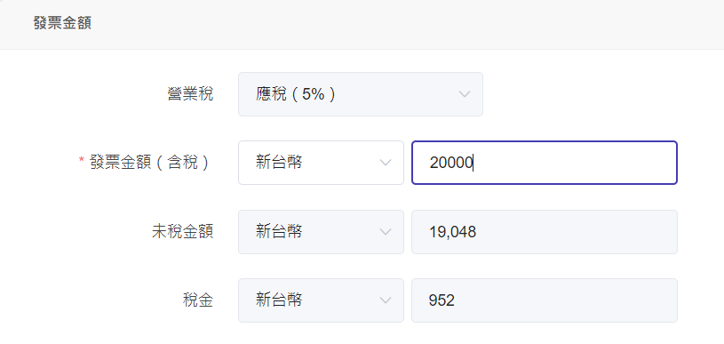
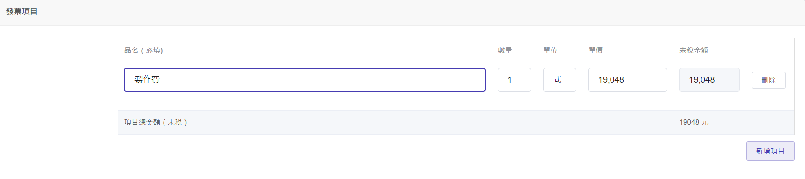

# 申請"非專案"發票

## 步驟一：選擇發票類型

| 類型 | 稅率 | 說明 |
| ------- | ------ | -------------------------------------------------------------- |
| 二聯式 | 應稅 | 開立國內銷貨發票給一般消費者。 無記載買受人名稱及統一編號。 |
| 三聯式 | 應稅 | 開立國內銷貨發票給營業人。 |
| INVOICE | 零稅率 | 產品屬零稅率銷售。 |

## 步驟二：填寫發票摘要

## 步驟三：選擇買受人(客戶)

## 步驟四：填寫預計發票日期

旁邊會顯示**最新發票日期**作為提示，避免手開發票日期開立異常狀況。

## 步驟五：填寫預計收款日

## 步驟六：填寫備註

## 步驟七：填寫發票金額

## 步驟八：填寫發票項目

若需開立不同項目，使用『新增項目』按鈕。
金額加總必須符合上方發票金額欄。

## 步驟九：送出

發票狀態　 → 　待開立
