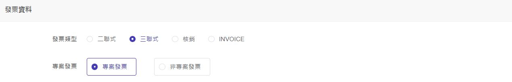
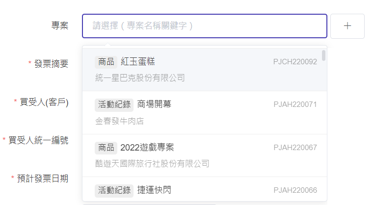
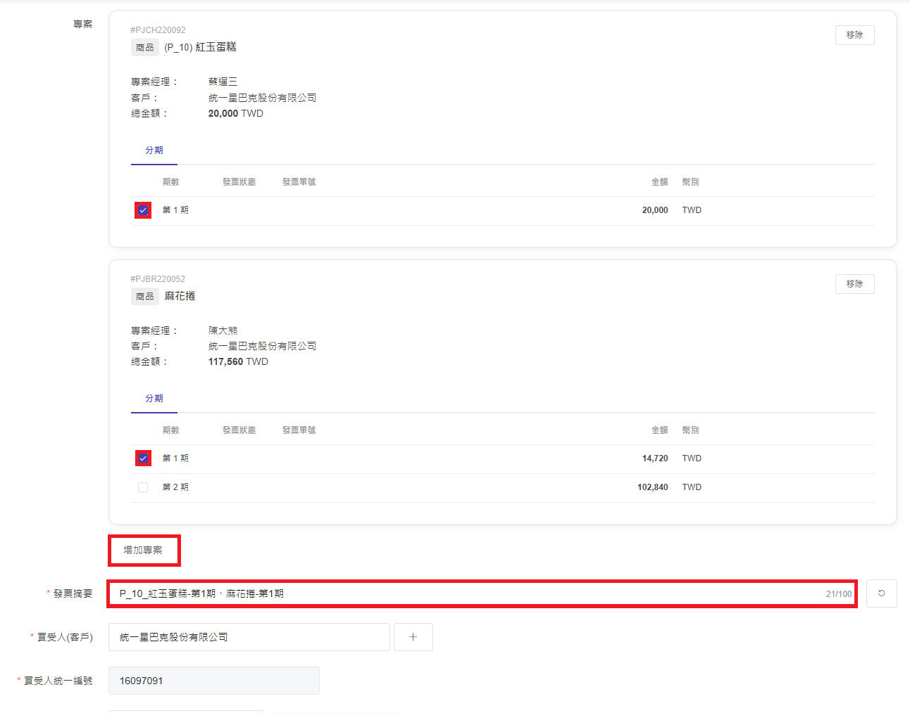
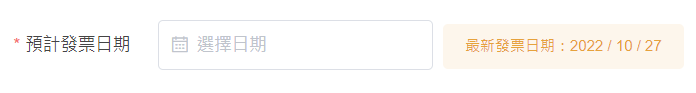
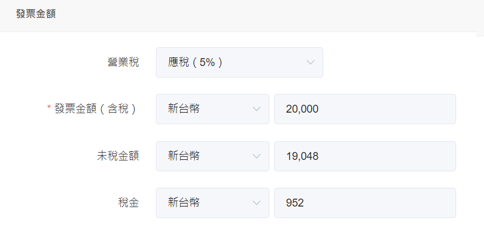

# 申請開立發票

## Step 1：填寫發票資料

| 類型 | 稅率 | 說明 |
| ------- | ------ | -------------------------------------------------------------- |
| 二聯式 | 應稅 | 開立國內銷貨發票給一般消費者。 無記載買受人名稱及統一編號。 |
| 三聯式 | 應稅 | 開立國內銷貨發票給營業人。 |
| 核銷 | 免稅 | 政府補助企劃以核銷方式作為收款依據。 |
| INVOICE | 零稅率 | 產品屬零稅率銷售。 |

- 選取專案， 並選擇分期，將自動帶入摘要。  
  使用 **"增加專案"** 按鈕，便能在一張發票同時開立多個專案。  
  

- 選擇買受人(客戶)

  
若客戶要求開立其他公司之統編，可在此修改，不須更動原專案的聯絡窗口。

## Step 5：填寫預計發票日期

  
旁邊會顯示**最新發票日期**作為提示，避免手開發票日期開立異常狀況。

## Step 6：填寫預計收款日

## Step 7：填寫備註

## Step 8：確認發票金額

  
此金額為選取專案自動加總，若金額錯誤，請至原專案進行修改。

## Step 9：填寫發票項目

若需開立不同項目，使用『新增項目』按鈕。  
金額加總必須符合原選取專案之分期金額。

## Step 10：送出

發票狀態　 → 　待開立
