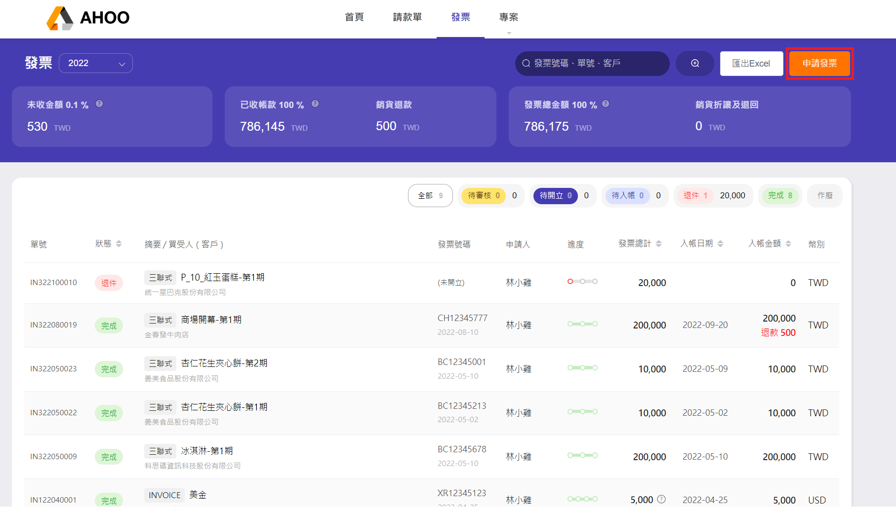
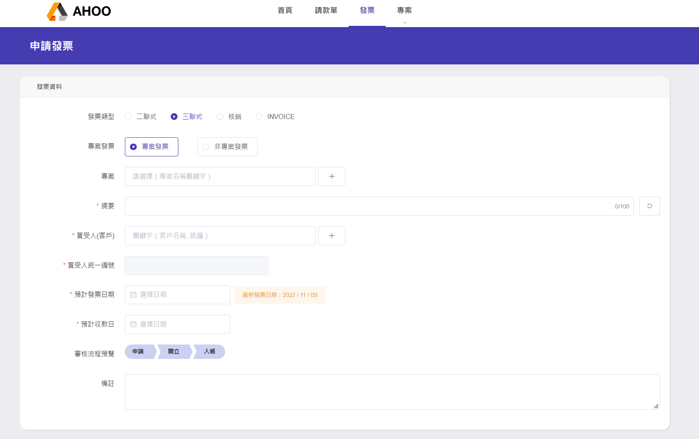
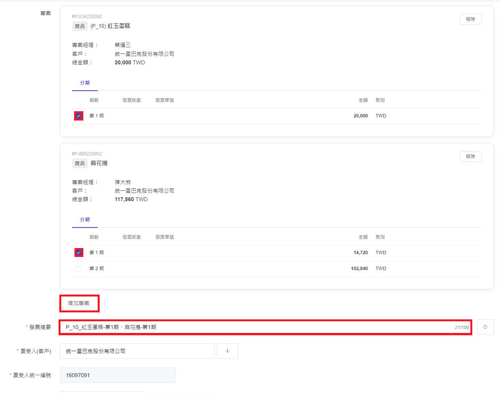
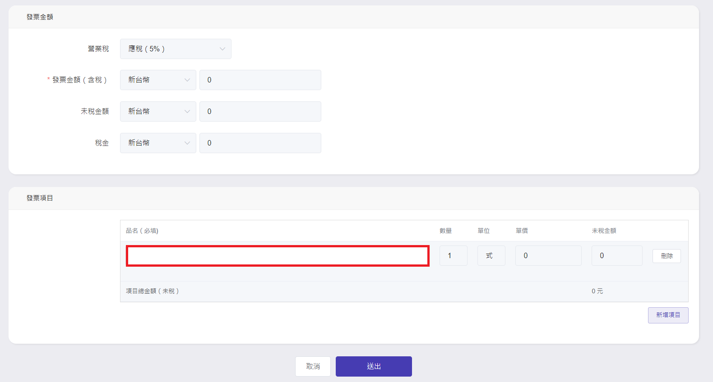
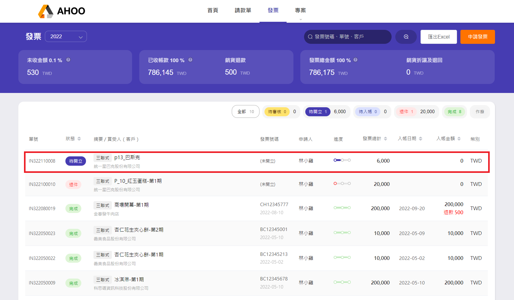

# 申請開立發票

## Step 1：申請發票

右上角『申請發票』  

## Step 2：填寫發票資料

- 選擇要開立的發票類型  
  
- 選擇專案 / 非專案  
  專案需勾選欲開立的期別（多個專案開同一張發票，點選 **"增加專案"** 。）  
   

- 選擇發票日期與預計收款日，可預覽審核流程。
- 填寫發票項目  
  

## Step 3：送出

『送出』發票申請後，會出現在列表上

