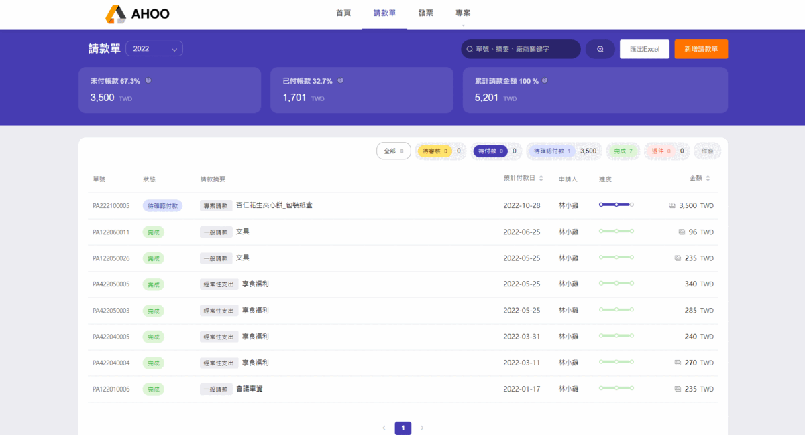
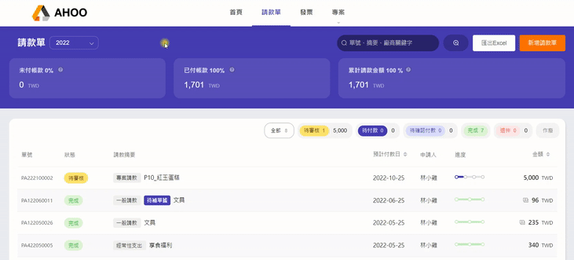
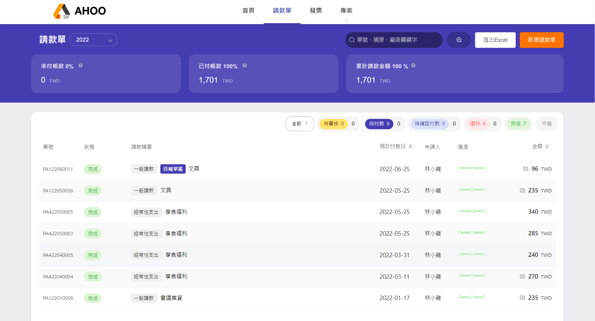
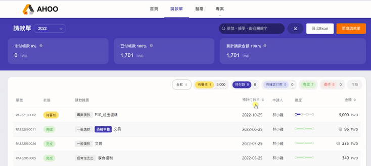

# 列表介紹

## ．請款單狀態

直接點選頁籤，可以快速篩選該狀態的請款單。  
| 狀態 | 說明 |
| ------------------------------------------------------------------------ | -------------------------------------------------------------- |
| 待審核 | 等待主管或指定人員審核。 |
| 待付款 | 送出請款資料，未填寫付款明細。 |
| 待付款ｖ | 暫存請款資料、付款明細。 |
| 待確認付款 | 已完成付款明細填寫，等待付款人員確認資訊。 |
| 待確認付款 🕒 | 預約未來日期付款，等待付款人員確認資訊。 |
| 完成 | 已確認付款。 |
| 退件 | 審核人發現異常，退回申請人。 申請人發現資料有誤，自行退回。 |

## ．切換年份

預設為當年度，可透過 左上角 **ｖ**下拉選單，調整想看的年別。  
依請款單 **申請日期** 作為歸屬。  

## ．金額欄位

依照各請款單的狀態，自動加總金額。

- **未付帳款**：待付款＋待確認付款
- **已付帳款**：完成
- **累計請款金額**：待付款＋待確認付款＋完成
-  待審核 與 退件 不納入計算。

:::tip 提醒

- 只能看到 **自己** 的請款單。
- 透過**即時**登載正確資料，讓平台反映真實營運狀況。  
  :::

## ．切換排序

預設依 **建立時間** 排序，最晚新增的請款單會在最上方。

點選＂預計付款日／金額＂欄位，可以切換排序方式，依序為：  
由舊到新 △ → 由新到舊 ▽ → 預設  
由小到大 △ → 由大到小 ▽ → 預設

