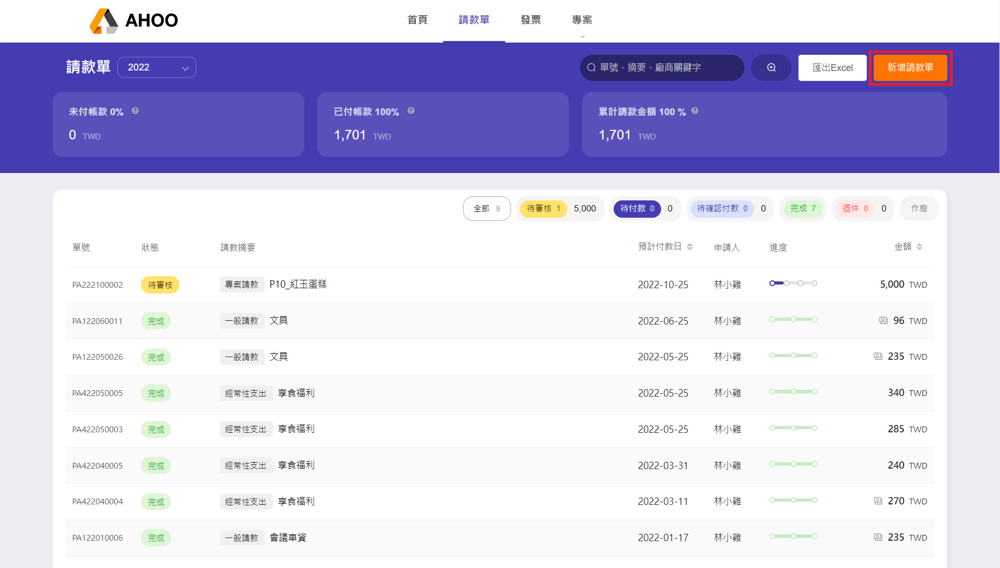
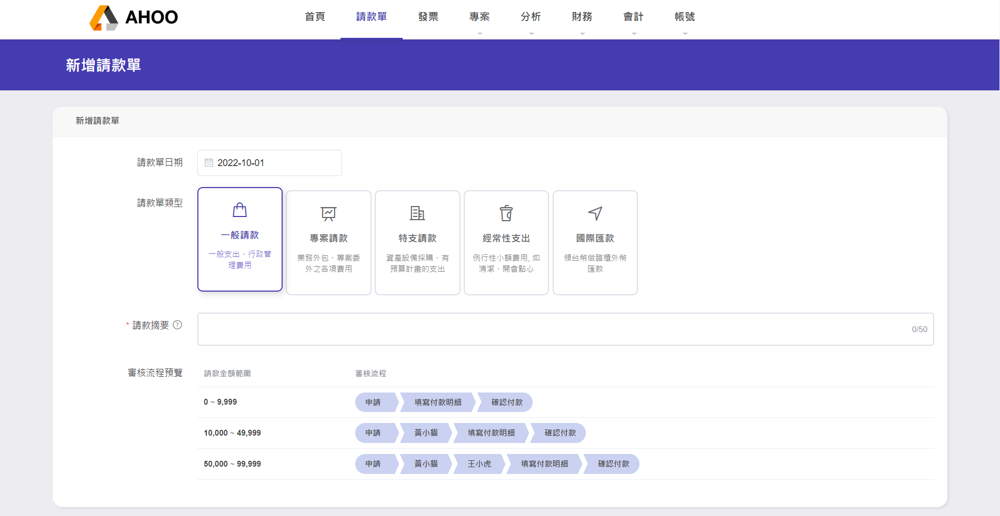
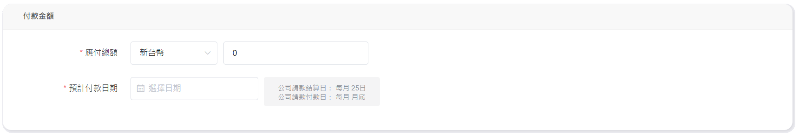
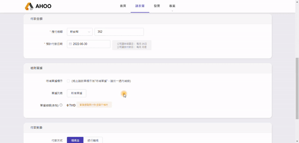
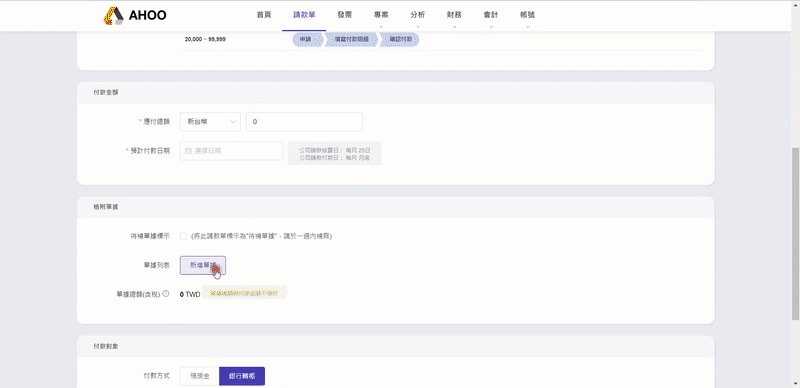

# 新增請款單

## **Step 1：新增請款單**

點選右上角『新增請款單』

## **Step 2：填寫請款單內容**

- **請款單日期**：預設為填寫日當天  
  :::warning
  此日期為分析資料的依據，補填**歷年資料**時，請特別注意時間。
  :::

- **請款單類型**：  
  |類型|說明|
  |--|--|
  |**一般請款**|一般支出、行政管理費用 例如：添購辦公用品，文具採買 |
  |**專案請款**|專案相關，包含委外製作的各項費用，作為專案成本與毛利的計算|
  |**特支請款**|為特別項目的支出 例如：資產設備採購、裝潢|
  |**經常性支出**|經常性的小額費用支出，可自動帶入摘要 例如：清潔費、享食福利、文具用品 |
  |**國際匯款**|需要領台幣進行臨櫃外幣匯款，請財務部門臨櫃填寫海外匯款單|

- **請款摘要**：  
  請填寫重要關鍵字，清楚也方便未來搜尋。

- **請款單預覽**：  
  預覽此請款單依不同金額而需經過的流程。

## **Step 3：填寫付款金額**

- **應付總額**：若有多張 **同幣別** 單據可一起請款，請填寫 **加總後** 的金額。

- **預計付款日期**：右邊灰色圖框，可參考公司預計於何時付款。

## **Step 4：新增單據**

- 點選新增單據

- 點選上傳檔案(若手邊暫無單據，可跳過上傳，直接填寫單據資訊，並參考 [待補單據](/employee/payment/receipt) )  
  選擇要上傳的圖片或 PDF，調整邊界，將不需要的區塊裁切，下一步

- 填寫單據資訊  
   **單據類型**：請依實際單據做選擇  
  電子發票／二聯式發票/三聯式發票(手開/收銀機)/收據/合約/勞務單/其他證明  
   **單據日期**：開立日期  
   **賣方公司名**：填寫公司名稱  
   **賣方統編**：請填寫賣方統編  
   **單據總額（含稅）**：填寫單據總額後，將自動計算營業稅與未稅金額。  
   **備註**：若有其他需註記的內容，可填寫於此

:::info 延伸功能
若有購買 401 申報功能，**單據類型**與**日期**將影響申報資料
:::

:::tip 快速選取歷史資料
輸入部分文字時，下方列表可快速選取過去曾經輸入過的資料，並自動帶入統編
:::

:::tip QRCODE 自動讀取
發票有完整清楚 QRCODE 時，上傳完可自動帶入發票資訊。  
(請留意拍照時勿傾斜，避免讀取失敗。)

:::

---

## **Step 5：選擇付款對象**

**付款方式**：選擇 領現金 / 銀行轉帳

**付款對象**：選擇 請款本人 ／ [委外廠商](/employee/project/vd) / [委外個人勞務](/employee/project/os)

---

## **Step 6：送出**

## 請款單狀態 → 待審核 / 待付款
