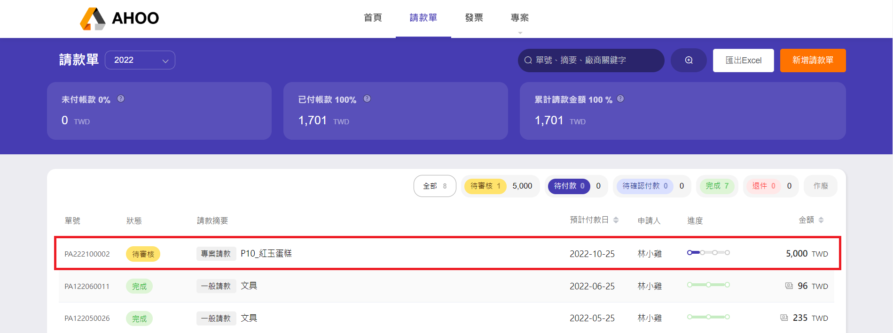

# 新增請款單

## **Step 1：新增請款單**

點選右上角『新增請款單』

## **Step 2：填寫請款單內容**

- 輸入請款單日期

- 點選要申請的請款單類型，填寫摘要後，可預覽審核流程

- 填寫付款金額，**一種幣別**填寫一張請款單。  
  

- 檢附單據，點選『新增單據』

- 無檢附單據時，也可以直接填寫單據資料，勾選 [待補單據](/employee/payment/receipt)

:::tip 快速 KEY IN
曾經輸入過的公司資料，可快速選取、自動帶入統編

:::

:::tip QRCODE 自動帶入資料
有完整清楚 QRCODE，上傳會自動帶入發票資訊。(單據翻拍勿傾斜，以免讀取失敗。)

:::

## **Step 3：送出**

『送出』請款單後，會出現在列表上  

