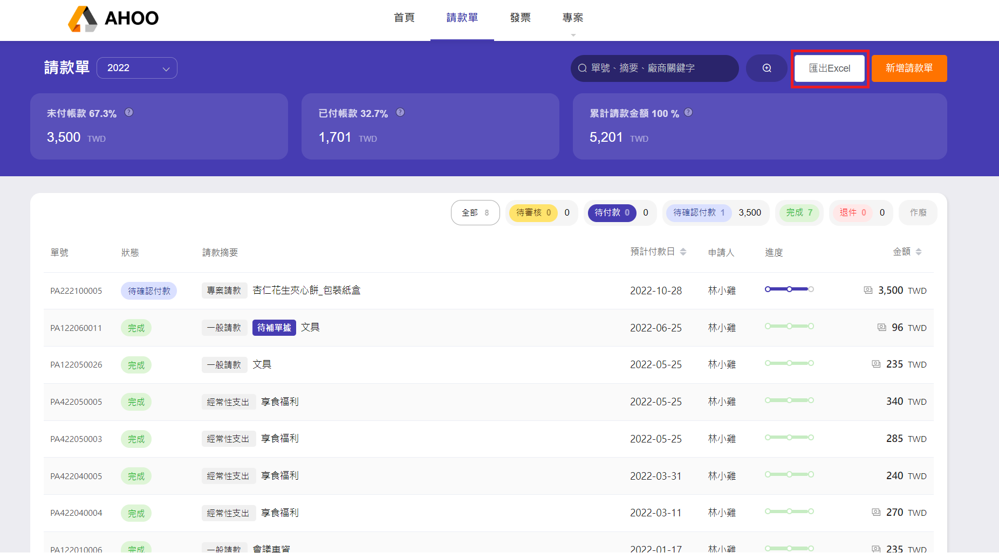

# 匯出請款單 Excel

:::info 有條件匯出部分資料
當有限定範圍時，請先[**搜尋請款單**](/employee/payment/search)。
:::

- 點選右上角『匯出 Excel』按鈕
- 將目前頁面的資料匯出檔名為 **請款單 xxxx-xx-xx(現在日期)** 之 Excel 檔  
   並自動依據發票狀態 **待審核**、**待付款**、**待確認付款**、**完成**建立分頁  
   退件、作廢與該標籤沒有請款單時，則不會建立分頁。

  
