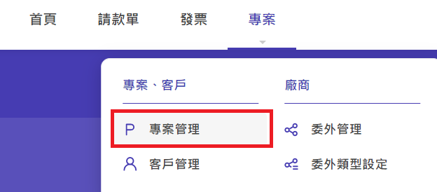
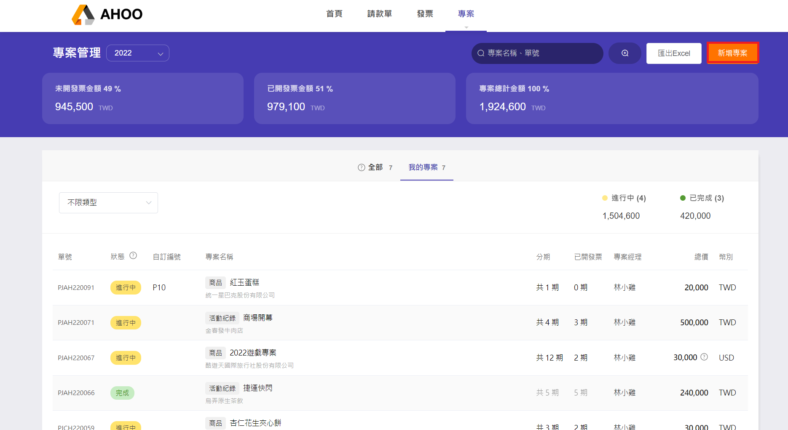
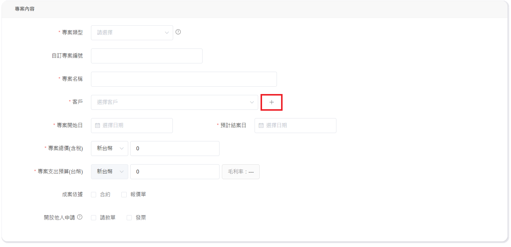
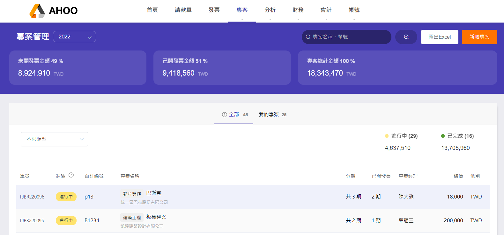

# 專案管理

由專案 PM 建立資料，在各自專案中申請專案請款與開立發票。

## Step 1：新增專案

點選右上角『新增專案』  

## Step 2：填寫專案內容與建立客戶資料

- 快速新增客戶『＋』，連續建立多筆客戶可至[建立客戶資料](/employee/project/vendor/)

- 開放他人申請：勾選後，其他員工可以對此專案 申請專案請款 與 申請開立發票

## Step 3：送出

