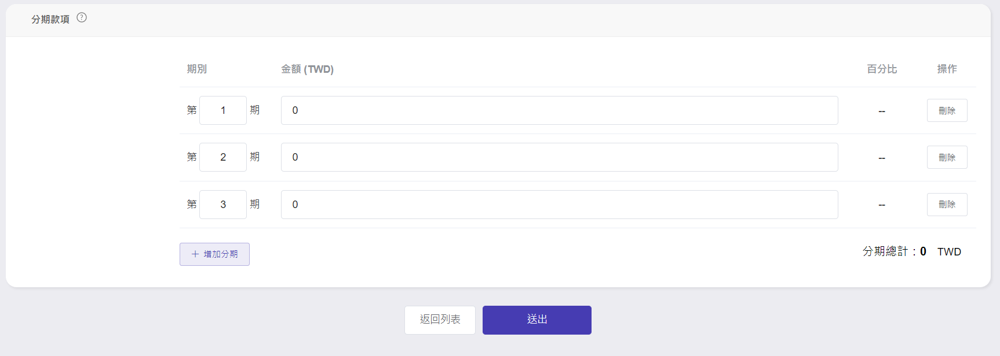

# 建立專案

## 步驟一 新增專案
點選右上角[新增專案]

## 步驟二 填寫專案內容  

**專案類型**  

**自訂專案編號**  
  
專案的頁面依據**執行年度**來排序，即**專案開始日**與**預計結案日**須包含其之間，才會呈現在該年度的頁面。

成案依據

開放他人申請
若此欄位未勾選，僅該新增此專案的專案經理**本人**才能申請相關費用。

## 步驟三 填寫專案備註
上限為200字。  

  
## 步驟四 填寫分期款項
按　＋新增分期　即可增加新一期的分期，注意各分期加總需與專案總金額相同。

  
## 步驟五 送出