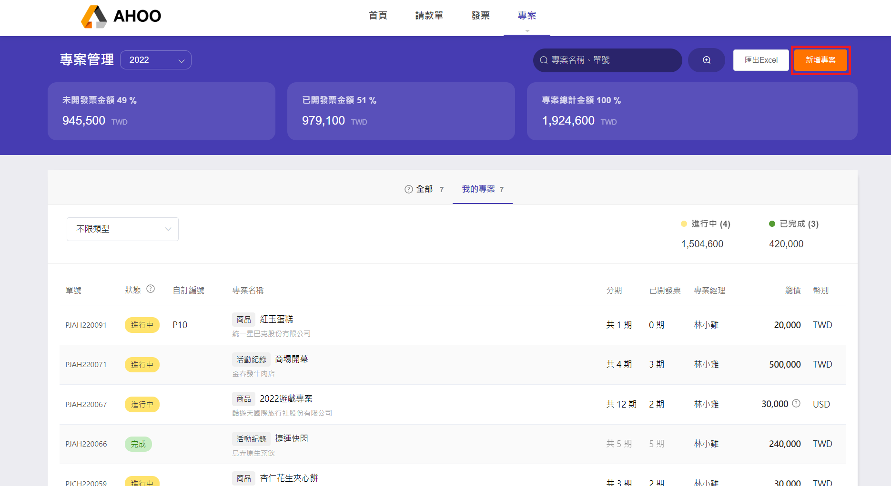

# 建立專案(PM)

在[申請專案請款](/employee/payment/create-payment/) 與[發票申請](/employee/invoice/create-invoice-project/)時，須先透過專案管理來建立專案。

專案 → 專案、客戶 － 專案管理

## Step 1：新增專案

點選右上角『新增專案』  

## Step 2：填寫專案內容

### 快速新增客戶

可以使用『＋』按鈕進行快速新增，完整建立資料請至[建立客戶資料](/employee/project/vendor/)

- 成案依據  
  勾選後會展開欄位，即可填寫合約起訖日，並上傳檔案  
  

- 開放他人申請  
  若此欄位未勾選，僅新增此專案的 PM**本人** 才能[申請請款單](/employee/payment/create-payment)與[申請發票](employee/invoice/create-invoice-project)。

## Step 3：填寫專案備註

上限為 200 字。  

## Step 4：填寫分期款項

按『＋ 新增分期』即可增加新的分期，注意各分期加總需與專案總金額相同。  

## Step 5：送出
