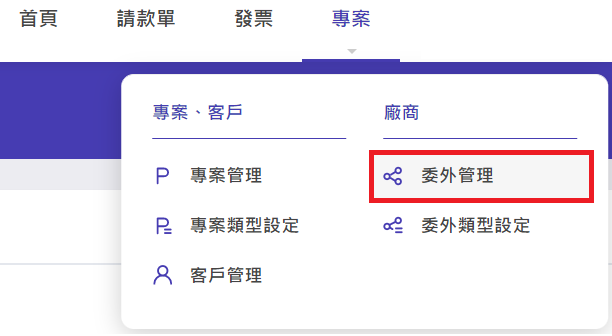
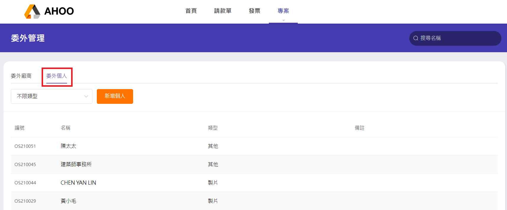
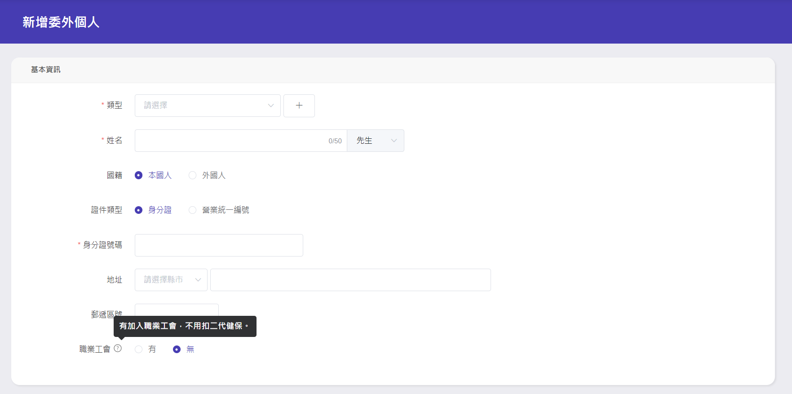
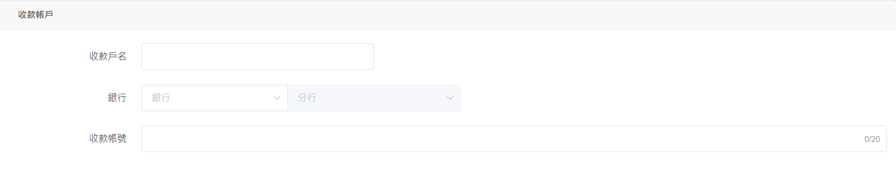
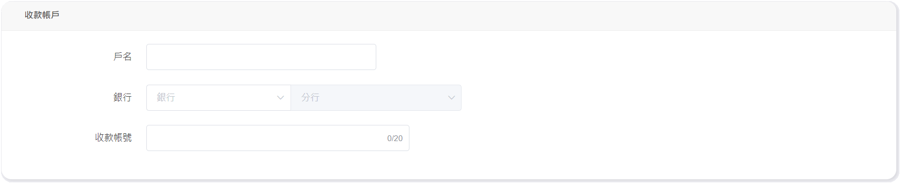
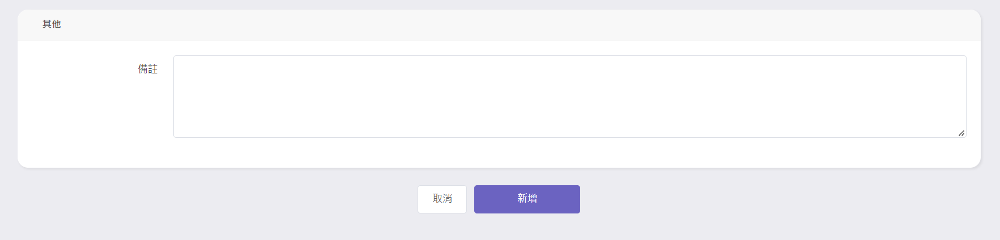

# 委外管理－個人／工作室資料

專案 → 廠商 － 委外管理  

:::info 幫同事請款
在委外個人中建立同事的資料，就能代為[申請請款單](/employee/payment/create-payment)。
:::

## Step 1：點選『委外個人』頁籤

## Step 2：點選『新增個人』

## Step 3：填寫資本資料

選擇類型，若無，可使用旁邊的『＋』來新增類型  
身份證號碼欄位將自動驗證資料，避免輸入錯誤
:::warning 二代健保
若有加入職業公會，務必勾選有，避免多扣二代健保。  
:::
:::info 勞務代扣
委外個人之請款金額超過 20,000 將自動計算 10%勞務稅與二代健保。  
二代健保險費率自 110 年 1 月 1 日調升為 2.11％，往前日期預設 1.91％。
:::

## Step 4：填寫收款帳戶

欄位內可輸入數字/文字，快速選取銀行  

## Step 5：填寫聯絡資料

## Step 6：填寫其他

## Step 7：點選『新增』
