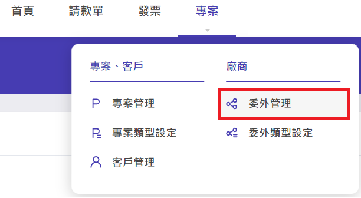
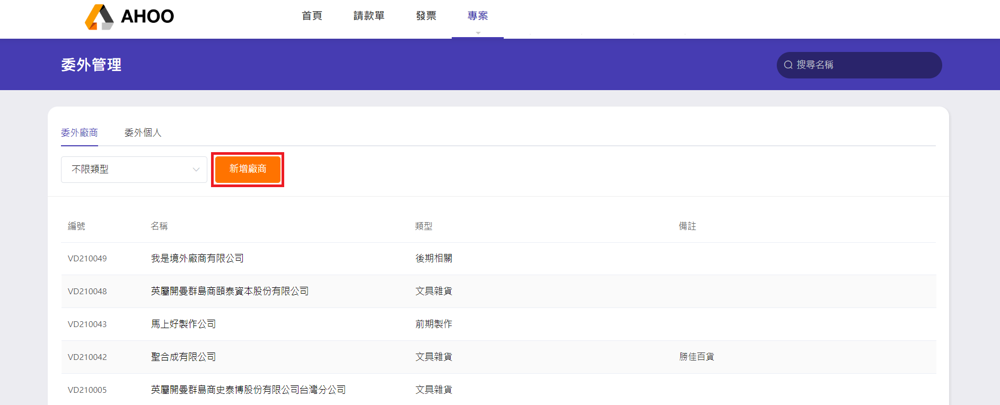
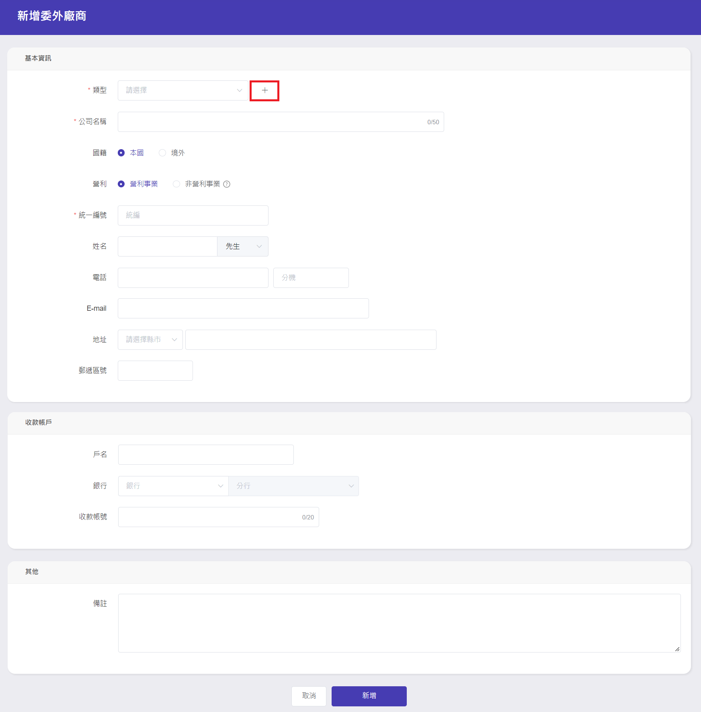
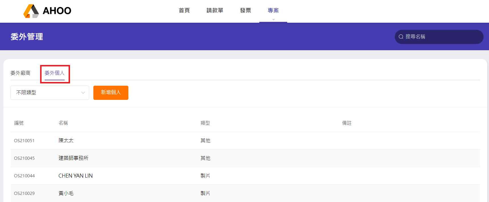
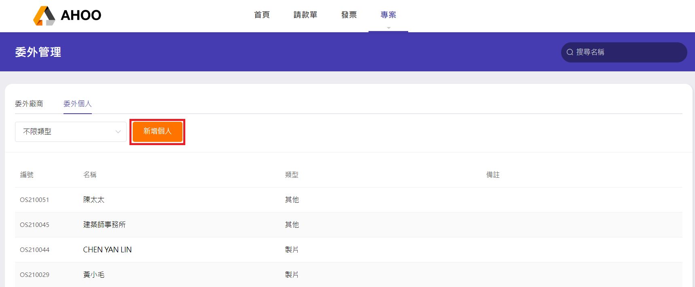
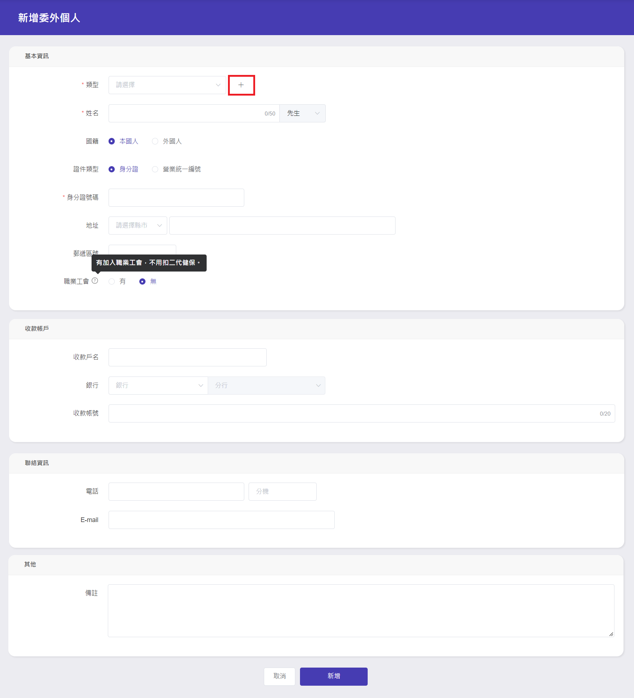

# 委外管理

## 廠商資料

建立廠商與供應商的資料。

### Step 1：點選『新增廠商』

點選『新增廠商』  

### Step 2：填寫基本資訊

- 填寫基本資訊，選擇類型，若無，可使用旁邊的『＋』來新增類型

- 點選『新增』

---

## 委外個人資料

建立委外個人與工作室的資料。

### Step 1：點選『委外個人』頁籤

### Step 2：點選『新增個人』

### Step 3：填寫基本資訊

- 填寫基本資訊，選擇類型，若無，可使用旁邊的『＋』來新增類型

- 點選『新增』  
  
