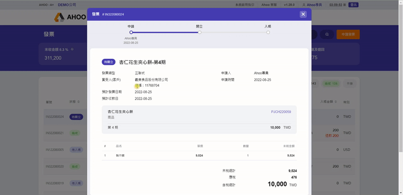
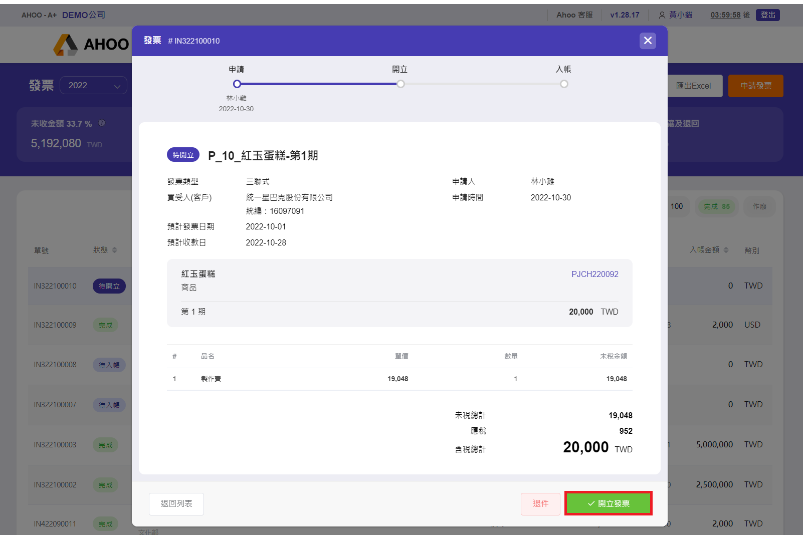

# 開立發票

## Step 1：點選發票申請單

## Step 2：點選『開立發票』

## Step 3：檢查資料正確

若內容錯誤，可使用『退件』  

## Step 4：填寫發票日期

## Step 5：填寫發票號碼

預先儲存好的[發票字軌](/finance/finance/invoice-serial-number)，將顯示在此  
點選即可自動填入前 7 碼，手動補上末 3 碼。

## Step 6：選擇收支項目

## Step 7：送出開立

發票狀態　 → 　待入帳
