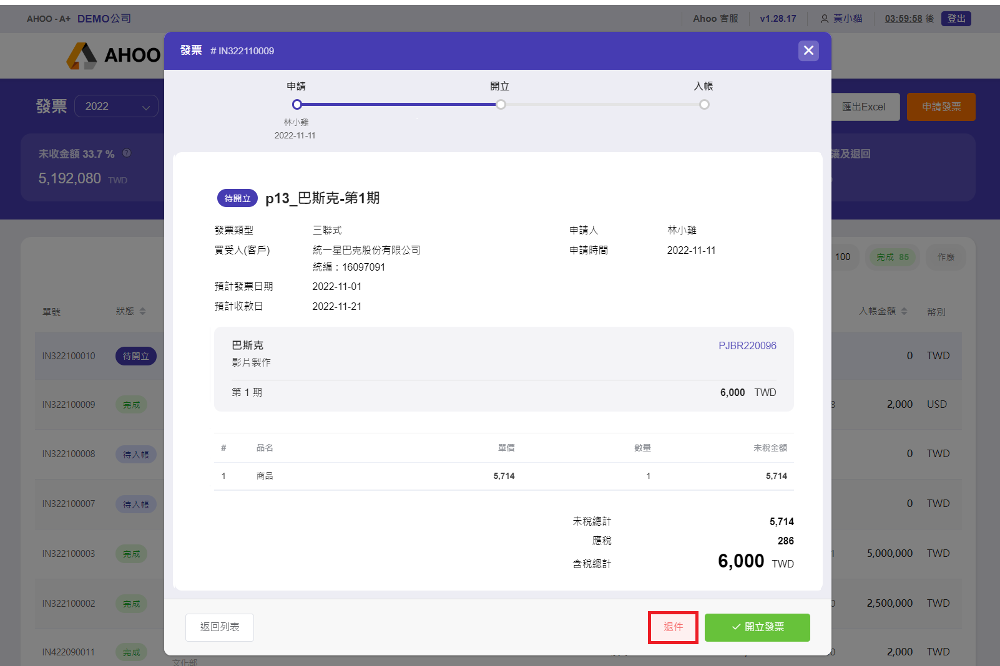
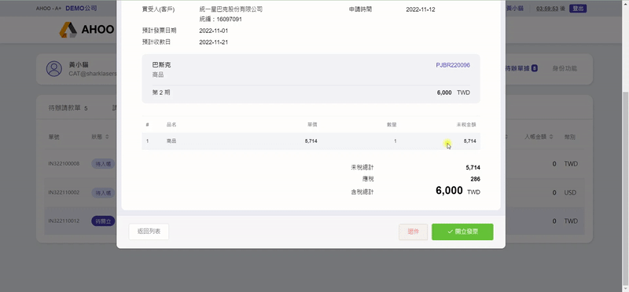
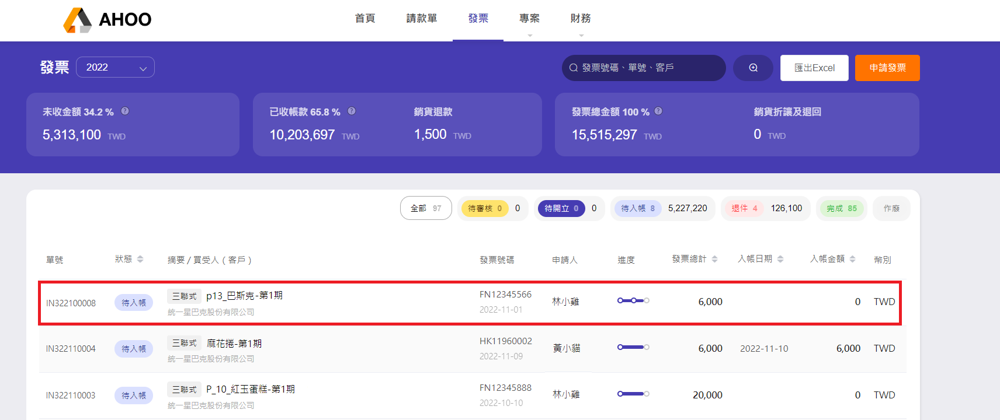

# 開立發票

## Step 1：點選待開立發票申請單

在首頁的『待辦發票』有待您處理的發票。  

## Step 2：核對內容與資訊

如果資料有錯誤，按 **『退件』** 按鈕  
寫明原因，**送出退件** ，將發票退回申請人。

## Step 3：點選『開立發票』

選擇日期、點選預存[發票字軌](/finance/finance/invoice-serial-number)KEY 完整號碼。  
收入項目可滑鼠點選或直接輸入關鍵字。

## Step 4：送出開立

