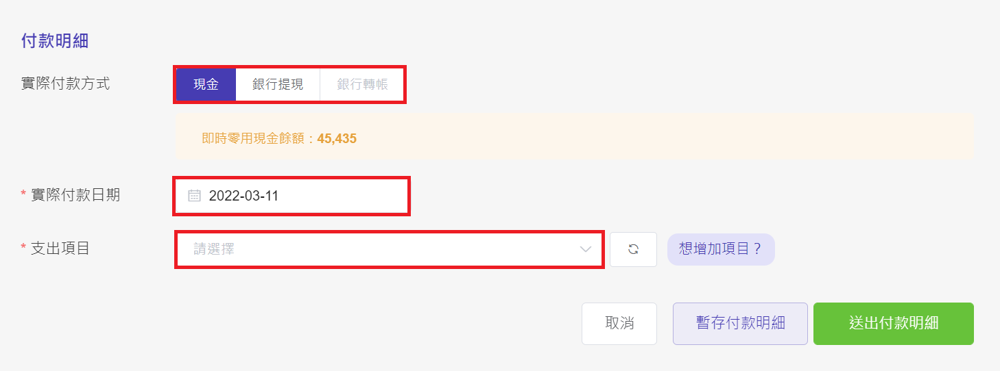

# 請款單付款

## Step 1：選擇待付款的請款單

在首頁的『待辦請款單』有待您處理的請款單。

## Step 2：核對內容與付款資訊

如果資料有錯誤，按 **『退件』** 按鈕  
寫明原因，**送出退件** ，將請款單退回申請人。

## **Step 3：填寫付款明細**

- 支出項目可滑鼠點選或直接輸入關鍵字。

## **Step 4：送出付款明細**

暫存可點選『暫存付款明細』  
如已付款可點選『送出付款明細』

