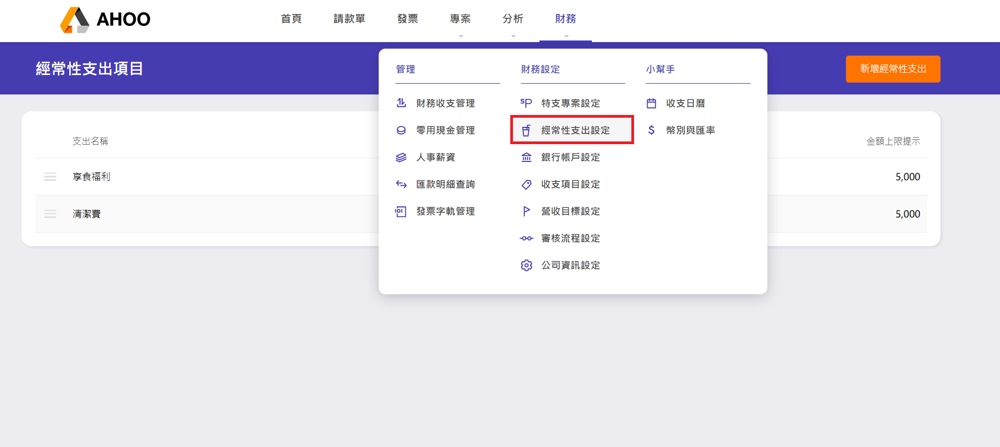
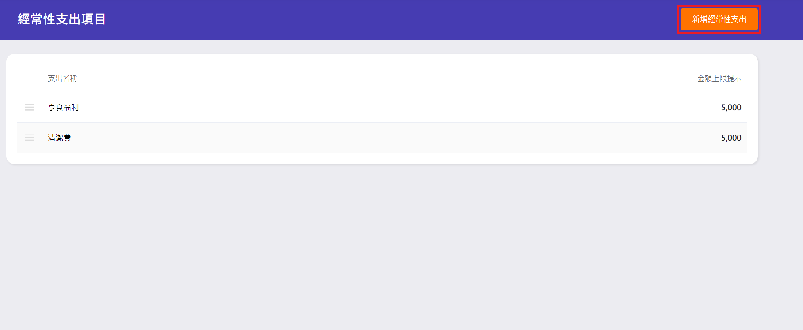
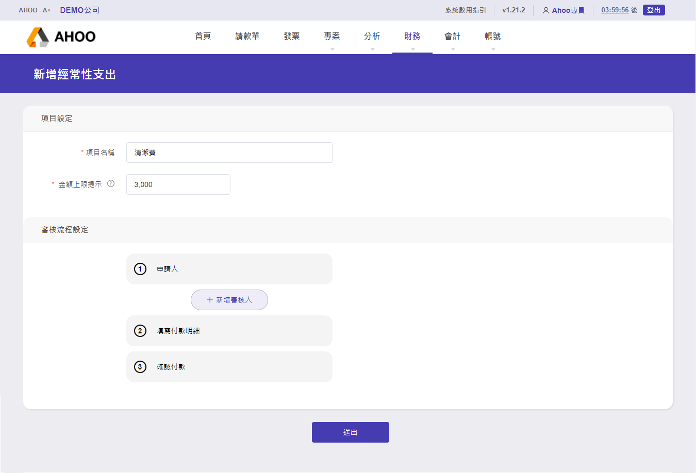
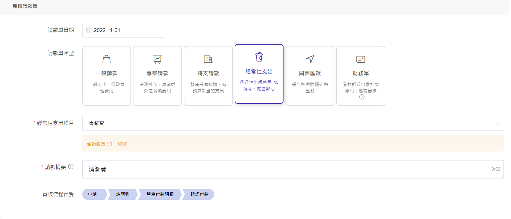

# 經常性支出設定

## -經常性支出為何

當公司有經常性小額費用支出，可透過此設定，讓[請款單申請](finance/payment/normal/)時自動帶入摘要，並指定審核人。  
例如：清潔費、享食福利、文具用品

## -新增經常性支出

點選右上角『新增經常性支出』  

填寫相關資訊、預算、設定審核人，所有關於此經常性支出的請款單，都必須透過此人審核通過，才能請款。  

:::info 請款單
設定好的經常性支出在請款單的呈現。

:::
