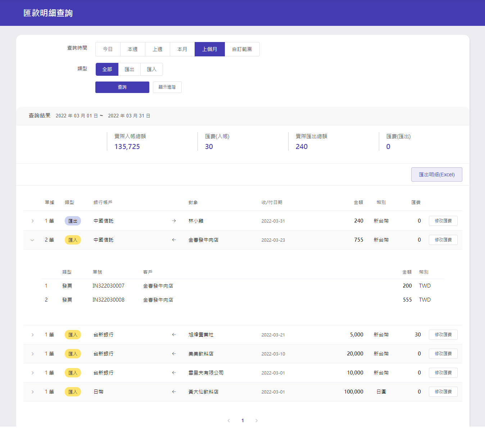
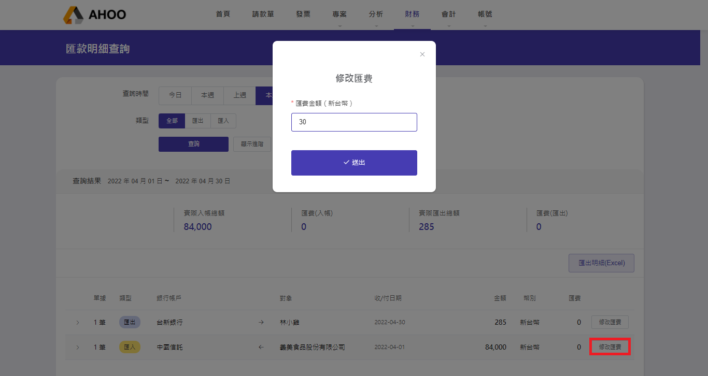
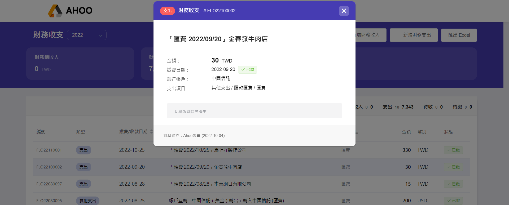

# 匯款明細查詢

  
**『匯入』**：來自發票入帳資料。  
**『匯出』**：來自請款單支出或發票退款。

可點選『查詢』或『顯示進階』，自訂查詢範圍與幣別。
使用『匯出明細（EXCEL）』功能時，將匯出符合篩選條件內容。

## 填寫匯費

點選要登載匯費款項右方的『修改匯費』按鈕。

按下『送出』即完成，費用自動產生在 [財務收支](/finance/finance/variable-statement/)列表。  
  
:::warning 注意
匯費在 [財務收支](/finance/finance/variable-statement/) 頁面僅供資料查找，金額編輯需回『匯款明細查詢』頁面修正。

:::
