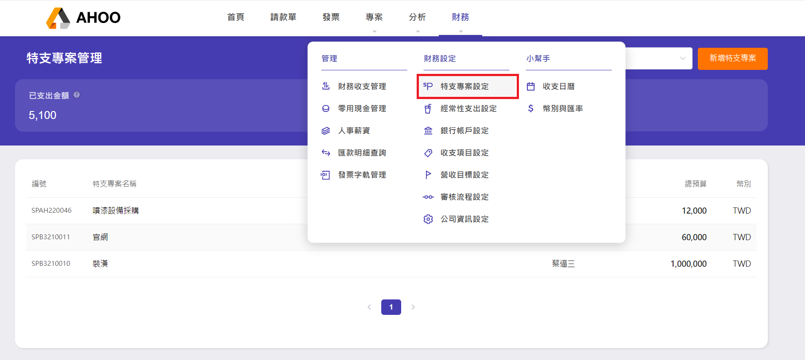
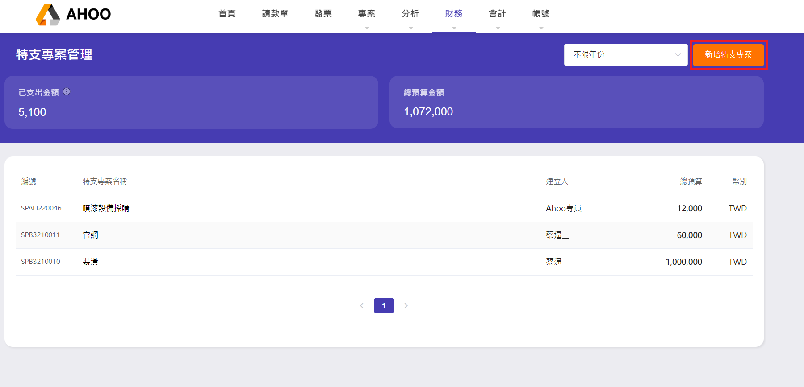
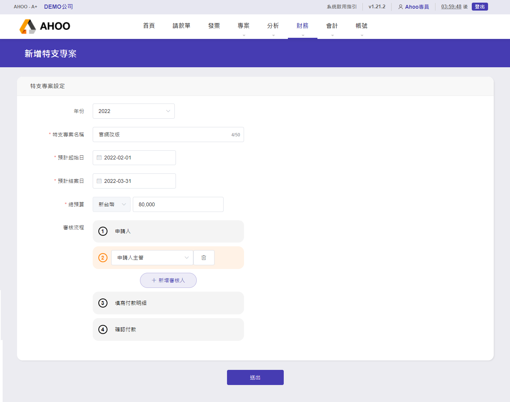
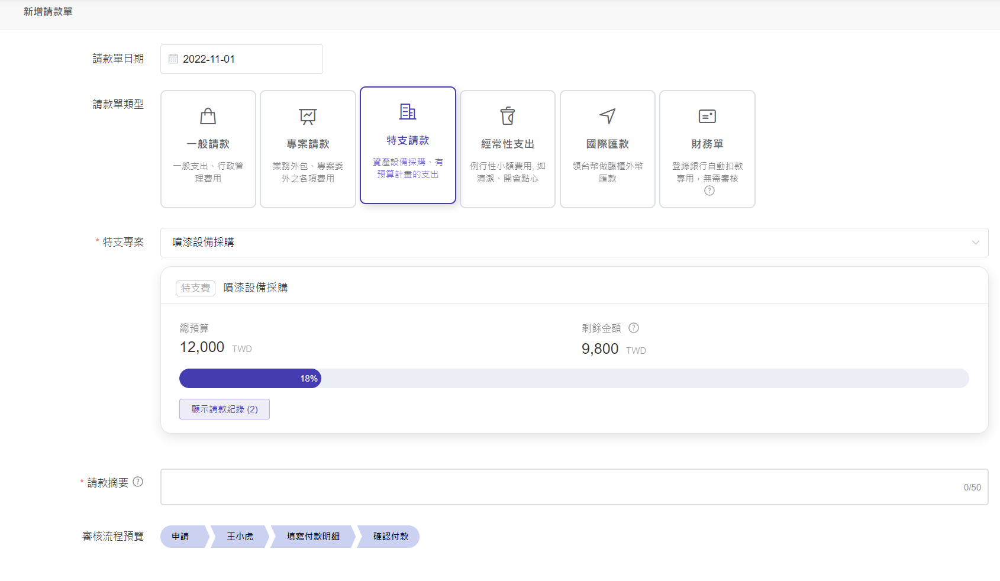
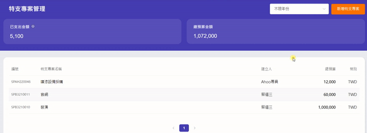

# 特支專案設定

## -特支專案為何

當公司有特定支出，需指定特定審核流程時，可以使用此功能設定相關項目，於[請款單申請](finance/payment/normal/)時可選擇。  
例如：設備資產支出、採購分期付款、裝潢工程

## -新增特支專案

點選右上角『新增特支專案』  

填寫相關資訊，包含年份、特支專案名稱、預計起始與結案日、總預算。  

設定審核人，則所有關於此特支專案的請款單，都必須透過此人審核通過，才能請款。  
:::info 請款單
設定好的特支專案在請款時，可以看到總預算與目前實際支出總額。

:::

## -選取年份

預設不限設年份，可透過 右上角 **ｖ**下拉選單，調整想看的年別。  

