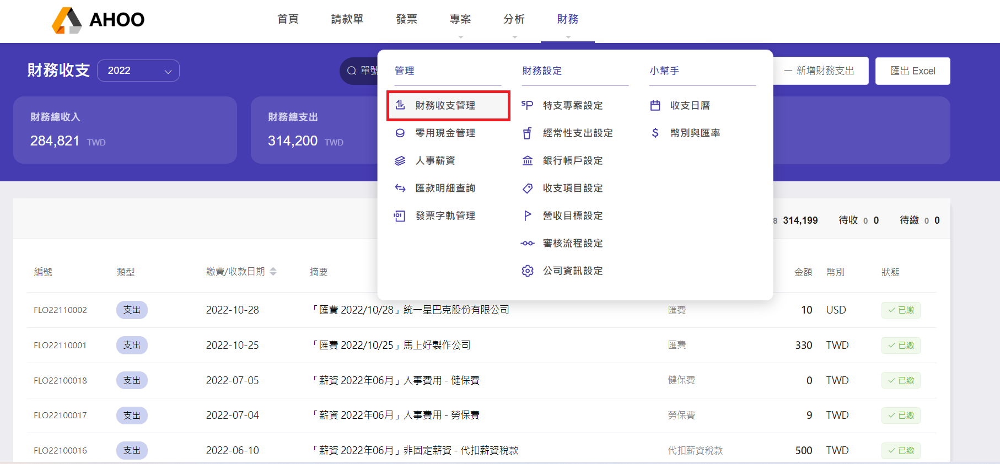
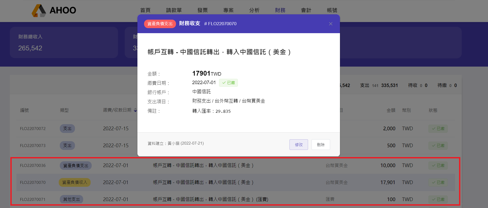
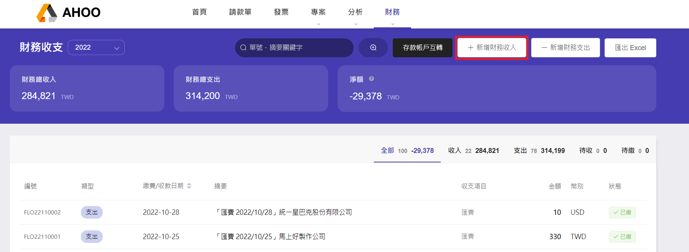
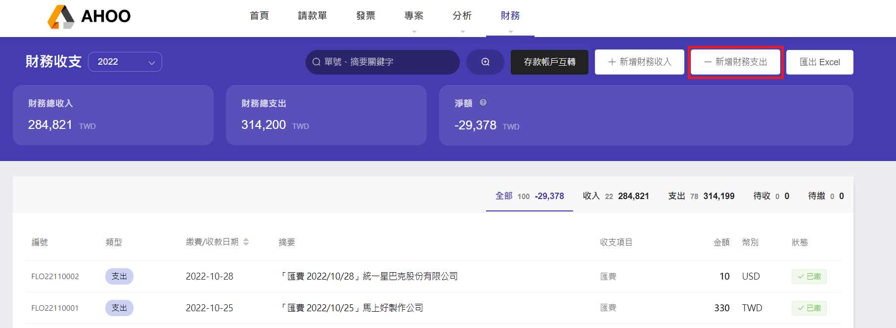
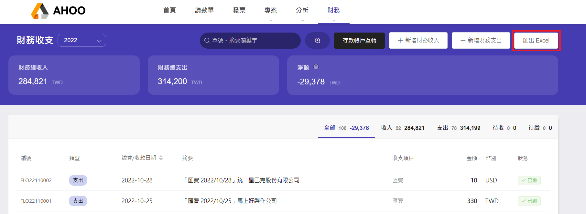

# 財務收支管理

非營業交易事項，不須透過請款程序，依據銀行存款進行收支紀錄  
例如：帳戶互轉、利息、營業稅款、所得稅、罰款損失……  
:::info 人事薪資
從[「人事薪資」](/finance/finance/salary/)所建立的代扣勞健保、[「匯款明細查詢」](/finance/finance/remittances/)建立的匯費，將自動呈現在此列表 
有編輯需求時，請至**原功能頁面**操作。
:::

## -新增存款帳戶互轉

當台外幣轉換，或自家的兩家銀行金流調度運用，可使用此功能。  
同時操作兩帳戶的收入與支出，並建立匯費。  

點選右上角『新增存款帳戶互轉』  
  
以 **台外幣互換** 為例

- 一邊選擇台幣帳戶，另一邊選取外幣帳戶。
- 填寫**轉出日期**，轉入日期會自動連動為**轉出日期**。
- 填寫**轉出金額**時，將自動計算**轉入金額**。
- 填寫**匯率**，若有**匯費**也請於此時登載。
- 選擇正確的**支出項目**與**收入項目**。
- 備註將自動存入此時填寫的匯率。
- 按下『送出』，便會產生財務收入與財務支出，與匯費的財務支出。  
  
  
  :::warning 注意：

- 若自動帶入轉入日期後，又手動調整轉入日期，不自動連動轉出日期
- 新增『帳戶互轉』後，若發現輸入錯誤，需再次進行編輯時， 兩筆資料不連動，請**分別修改**兩筆資料的正確資訊。  
  :::

## -新增財務收入

點選右上角『新增財務收入』  

選擇類型 『其他收入』／『資產負債收入』  
填寫摘要、銀行帳戶、收款日期、金額、選擇收入項目、填寫備註後，按下『送出』即完成。

## -新增財務支出

點選右上角『新增財務支出』  

選擇類型 『其他支出』／『資產負債支出』  
填寫摘要、銀行帳戶、付款日期、金額、選擇支出項目、填寫備註後，按下『送出』即完成。  

## -調整排序

預設依 **建立時間** 排序，最晚新增的項目在最上方。  
點選＂繳費／收款日期＂欄位（或 △▽）  
可切換排序方式：由舊到新 → 由新到舊 → 預設  

## -匯出 Excel

點選右上角『匯出 Excel』，檔案將依收入與支出分開建立兩個分頁。  

