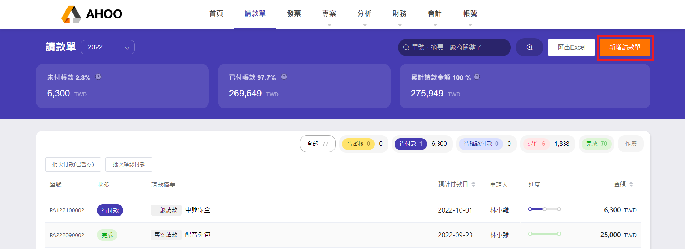

# 建立"財務單"

## **步驟一：新增請款單**

點選右上角［新增請款單］  

---

## **步驟二：填寫請款單內容**  

**請款單日期**：預設為填寫日當天  
:::warning
此日期為分析資料的依據，補填**歷年資料**時，請特別注意時間。
:::

**請款單類型**：  
選擇「財務單」，限有付款權限的人員操作。  
此類型不須經過審核，送出即直接完成。  
使用情況為「營業費用」的水電、中華電信、停車費或設定銀行自動扣款。  
  
**請款摘要**：  
填寫重要關鍵字，以便未來搜尋使用。  
  

---

## **步驟三：填寫付款金額**  
  
**應付總額**：若有多張單據要一起請款，請填寫加總後的金額  
**轉出帳戶**：選擇轉出帳戶  
**付款日期**：選擇付款日期  
**支出項目**：選擇支出項目 

:::tip 快速選取
欄位中輸入項目名稱部分關鍵字，可搜尋想選擇的項目。

:::
---

## **步驟四：新增單據**  

點選新增單據  

點選上傳檔案，選擇要上傳的圖片或PDF  
  
調整邊界，將不需要的區塊裁切。  

填寫單據資訊時，圖片將呈現在旁邊，可直接比對填寫資訊。  

**單據類型**：依實際單據來選擇  
　　　　　電子發票／二聯式發票/三聯式發票(手開/收銀機)/收據/合約/勞務單/其他證明  
**單據日期**：開立日期  
**賣方公司名**：填寫公司名稱
:::info 延伸功能
若有購買401申報功能，**單據類型**與**日期**將影響申報資料
:::

:::tip 快選歷史資料
曾輸入過的資料，輸入部分文字時，下方列表可快速選取，並自動帶入統編
:::

:::tip QRCODE自動讀取
發票有完整清楚QRCODE時，上傳完可自動帶入發票資訊。(請留意拍照時勿傾斜，避免讀取失敗。)

:::

**賣方統編**：請填寫賣方統編  

**單據總額（含稅）**：填寫單據總額後，將自動計算營業稅與未稅金額。  

**備註**：若有其他需註記的內容，可填寫於此  

---

## **步驟五：送出**  
請款單狀態　→ 完成　　

:::warning
由於財務單送出後就直接完成，僅能修改 **支出項目**

  
以及編輯**實際付款日期**、**銀行帳戶**。  

  

若是**摘要**內容或**金額**填寫錯誤，只能 **「作廢」** 請款單，重新再填寫一張囉！
:::
---
