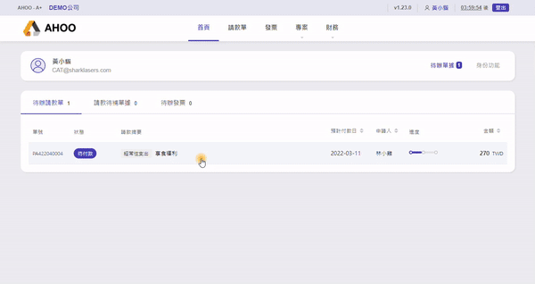
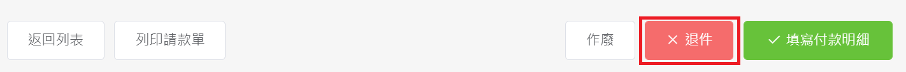
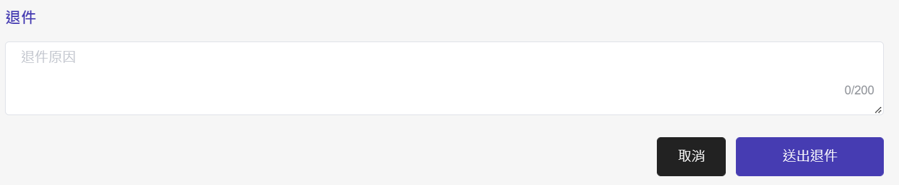
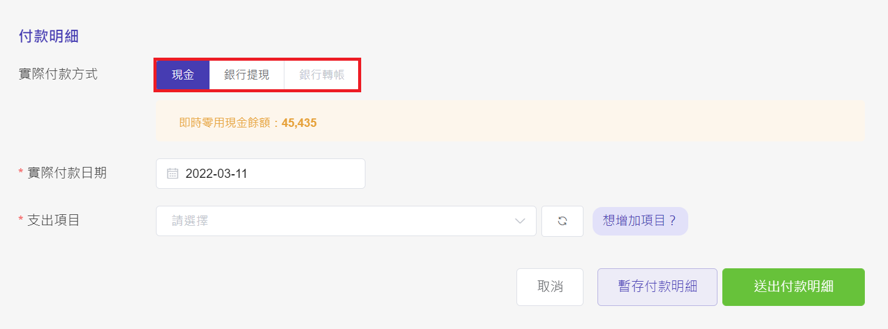
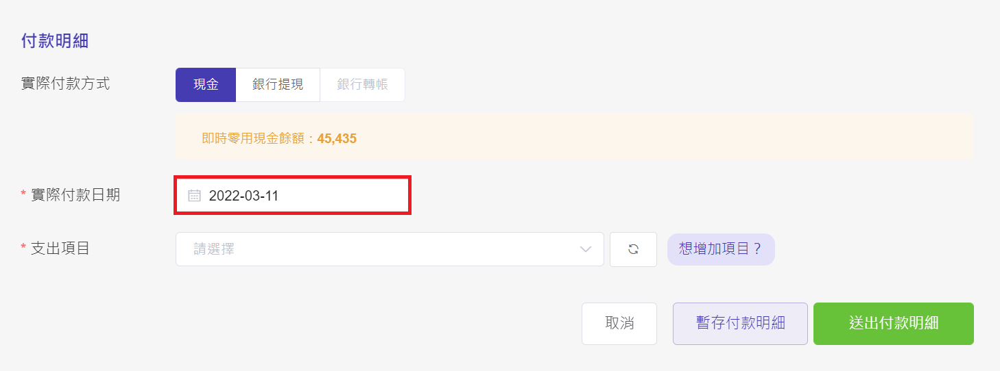
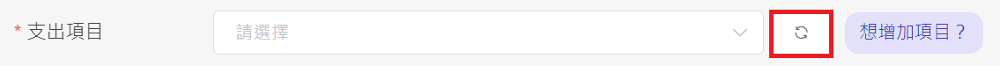
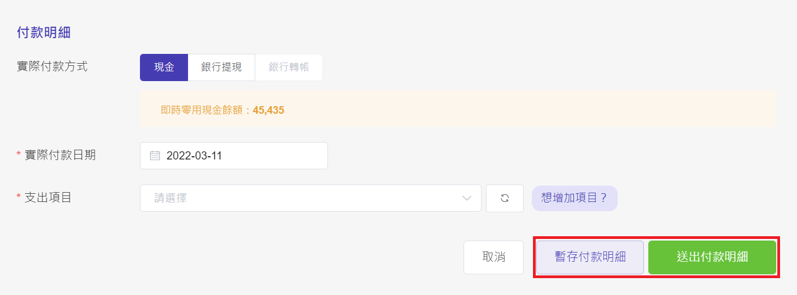

# 審核與填寫付款明細

## **步驟一：點選請款單**

## **步驟二：檢查資料是否正確**

若有錯誤，可使用最下方的**退件**按鈕

寫明原因，**送出退件** ，將請款單退回申請人。

## **步驟三：確認付款方式**

  
若原申請付款方式為 **「現金」**，可透過 **「銀行提現」** ，改由帳戶撥款。  
如需更改為 **「銀行轉帳」** ，則須**退件**，由申請人補上付款對象的帳戶資訊。

## **步驟四：填寫付款日期**

## **步驟五：選擇支出項目**

此項目為支出分析歸類的依據，請務必填寫正確。

:::tip 快速搜尋
在欄位中直接輸入名稱，就能透過搜尋，快速選取項目啦！
  
:::

:::tip 找不到剛剛新增的項目？
點選旁邊的雙箭頭按鈕，重新整理過後，就能選取新增項目囉！
  
:::

## **步驟六：送出付款明細**

  
若選擇暫存付款明細，送出後  
請款單狀態將轉為 → 　待付款ｖ

送出付款明細  
請款單狀態 → 待確認付款
