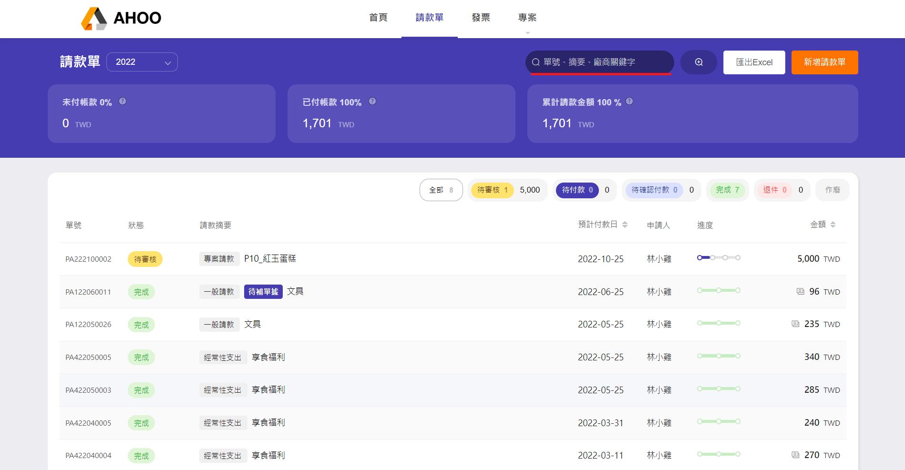
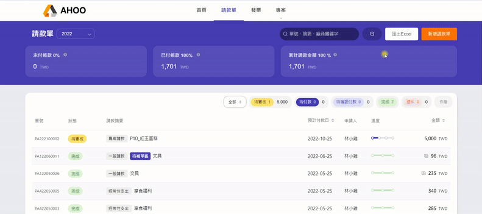

# 搜尋功能

## 快速搜尋
搜尋框僅能查詢預設內容：單號、自訂專案編號、摘要、廠商關鍵字。  
若要搜尋其他條件，或需要同時滿足多種條件，請使用 **「進階搜尋」** 功能。  
欄位內的數字加總將隨搜尋條件自動更新。 
 

## 進階搜尋
點選右上角＋符號的放大鏡🔍，即可切換至 「進階搜尋」模式  
選擇多項條件能幫助您更快速查找資料。  
部分條件開放複選方式查找（多位申請人、多個帳戶……等等）

:::tip 搭配狀態標籤
核對多筆資料時，可點選狀態標籤來限縮範圍喔！
:::